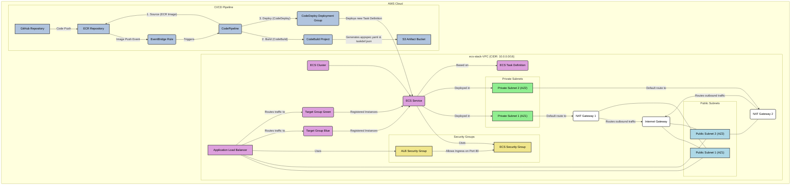

```mermaid
graph TD
    subgraph AWS Cloud
        subgraph VPC_MAIN["ecs-stack-VPC (CIDR: 10.0.0.0/16)"]
            direction TB
            InternetGateway(Internet Gateway)

            subgraph PublicSubnets["Public Subnets"]
                direction LR
                PublicSubnet1["Public Subnet 1 (AZ1)"]
                PublicSubnet2["Public Subnet 2 (AZ2)"]
            end

            subgraph PrivateSubnets["Private Subnets"]
                direction LR
                PrivateSubnet1["Private Subnet 1 (AZ1)"]
                PrivateSubnet2["Private Subnet 2 (AZ2)"]
            end

            NatGateway1(NAT Gateway 1)
            NatGateway2(NAT Gateway 2)

            InternetGateway --- PublicSubnet1
            InternetGateway --- PublicSubnet2

            PublicSubnet1 --- NatGateway1
            PublicSubnet2 --- NatGateway2

            NatGateway1 -- Routes outbound traffic --> InternetGateway
            NatGateway2 -- Routes outbound traffic --> InternetGateway

            PrivateSubnet1 -- Default route to --> NatGateway1
            PrivateSubnet2 -- Default route to --> NatGateway2

            subgraph SecurityGroups["Security Groups"]
                ALBSG[ALB Security Group]
                ECSSG[ECS Security Group]
            end

            ALB[Application Load Balancer]
            ALB --- PublicSubnet1
            ALB --- PublicSubnet2
            ALB -- Uses --> ALBSG

            ECSCluster(ECS Cluster)
            ECSService(ECS Service)
            ECSTaskDefinition(ECS Task Definition)

            ECSCluster --> ECSService
            ECSService -- Deployed in --> PrivateSubnet1
            ECSService -- Deployed in --> PrivateSubnet2
            ECSService -- Uses --> ECSSG
            ECSService -- Based on --> ECSTaskDefinition

            ALBSG -- Allows Ingress on Port 80 --> ECSSG
            ALB -- Routes traffic to --> TargetGroupBlue(Target Group Blue)
            ALB -- Routes traffic to --> TargetGroupGreen(Target Group Green)
            TargetGroupBlue -- Registered Instances --> ECSService
            TargetGroupGreen -- Registered Instances --> ECSService

        end

        subgraph CICDPipeline["CI/CD Pipeline"]
            direction LR
            GitHubRepo[GitHub Repository]
            ECRRepo[ECR Repository]
            CodePipeline(CodePipeline)
            CodeBuild(CodeBuild Project)
            CodeDeploy(CodeDeploy Deployment Group)
            S3Artifacts[S3 Artifact Bucket]

            GitHubRepo -- Code Push --> ECRRepo
            ECRRepo -- Image Push Event --> EventBridgeRule(EventBridge Rule)
            EventBridgeRule -- Triggers --> CodePipeline

            CodePipeline -- 1. Source (ECR Image) --> ECRRepo
            CodePipeline -- 2. Build (CodeBuild) --> CodeBuild
            CodeBuild -- Generates appspec.yaml & taskdef.json --> S3Artifacts
            CodePipeline -- 3. Deploy (CodeDeploy) --> CodeDeploy
            CodeDeploy -- Deploys new Task Definition --> ECSService
        end
    end

    %% Legend/Notes
    style InternetGateway fill:#fff,stroke:#333,stroke-width:2px,color:#000
    style NatGateway1 fill:#fff,stroke:#333,stroke-width:2px,color:#000
    style NatGateway2 fill:#fff,stroke:#333,stroke-width:2px,color:#000
    style PublicSubnet1 fill:#add8e6,stroke:#333,stroke-width:2px,color:#000
    style PublicSubnet2 fill:#add8e6,stroke:#333,stroke-width:2px,color:#000
    style PrivateSubnet1 fill:#90ee90,stroke:#333,stroke-width:2px,color:#000
    style PrivateSubnet2 fill:#90ee90,stroke:#333,stroke-width:2px,color:#000
    style ALBSG fill:#f0e68c,stroke:#333,stroke-width:2px,color:#000
    style ECSSG fill:#f0e68c,stroke:#333,stroke-width:2px,color:#000
    style ALB fill:#dda0dd,stroke:#333,stroke-width:2px,color:#000
    style ECSCluster fill:#dda0dd,stroke:#333,stroke-width:2px,color:#000
    style ECSService fill:#dda0dd,stroke:#333,stroke-width:2px,color:#000
    style ECSTaskDefinition fill:#dda0dd,stroke:#333,stroke-width:2px,color:#000
    style TargetGroupBlue fill:#dda0dd,stroke:#333,stroke-width:2px,color:#000
    style TargetGroupGreen fill:#dda0dd,stroke:#333,stroke-width:2px,color:#000

    style ECRRepo fill:#b0c4de,stroke:#333,stroke-width:2px,color:#000
    style GitHubRepo fill:#b0c4de,stroke:#333,stroke-width:2px,color:#000
    style CodePipeline fill:#b0c4de,stroke:#333,stroke-width:2px,color:#000
    style CodeBuild fill:#b0c4de,stroke:#333,stroke-width:2px,color:#000
    style CodeDeploy fill:#b0c4de,stroke:#333,stroke-width:2px,color:#000
    style S3Artifacts fill:#b0c4de,stroke:#333,stroke-width:2px,color:#000
    style EventBridgeRule fill:#b0c4de,stroke:#333,stroke-width:2px,color:#000
```